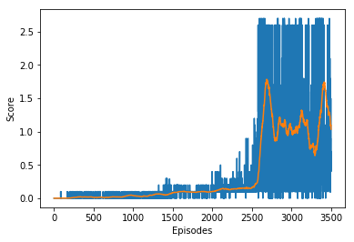

# Report of Collaboration and Competition

The environment of this project is the second version described in [README](README.md). There are 2 agents In this environment.  For each agent, state size is 24 and action size is 2. The solution to the DDPG coding exercise is utilised in this project.

## Learning Algorithm

### DDPG Algorithm

The agent in this environment is trained with [DDPG](https://arxiv.org/pdf/1509.02971.pdf)(Deep Deterministic Policy Gradient) algorithm which concurrently learns a Q-function and a policy. It is applied to solve environment with continuous actions. There are two kinds of networks, actor and critic. The actor network output actions with given states. The critic network implement Q-learning. 

In each training step, the environment generates 2 experiences(state, action(with a noise), reward, next_state, done), add them to `replaybuffer`, and then update each agent once. The environment is solved when the average max score over the last 100 episodes  is at least +0.5. 

###  Hyper Parameters 

The hyperparameters are chose as follows. 

> Actor-Critic network 

Both `Actor` and `Critic` contain  3 hidden layers with 2 ReLU activation functions , `fc1_units=128`, `fc2_unit=32`. At the end of  `Actor`, there is  an extra `tanh` activation function to guarantee that the range of actions is (-1, 1). And there is a normally distributed noise on the action.

>  Agent

* `BUFFER_SIZE = 1e5`         # replay buffer size
* `BATCH_SIZE = 128`             # minibatch size
* `GAMMA = 0.99`            	  # reward discount factor
* `TAU = 1e-3`             		# for soft update of target parameters
* `LR_ACTOR = 3e-4`             # learning rate of actor
* `LR_CRITIC = 3e-4`            # learning rate of critic

> Train

* `n_episodes = 3500`      # max number of training episodes(this number is large, set early stopping is necessary) 
* `max_t = 1000`              # max step in each episode

## Plot of Rewards

The result is shown in the figure bellow. The environment is solved in 2593 epochs, average score of 100 episodes(2494 to 2593) is 0.5192(larger than 0.5). 

## Ideas for Future Work

* The neural network can be deeper and dropout can be introduced.
* The hyperparameters can be fine tuned, especially the parameter of noise. If the noise is too small, then the experiences are strongly related. If the noise is too large, then there can't be many steps in each episode. 
* The symmetric of the environment can be taken into consideration and then the two agents can share experiences and learn more quickly.
* Try more algorithms like [PPO](https://arxiv.org/pdf/1707.06347.pdf), [A3C](https://arxiv.org/pdf/1602.01783.pdf), and [D4PG](https://openreview.net/pdf?id=SyZipzbCb) that use multiple (non-interacting, parallel) copies of the same agent to distribute the task of gathering experience.